## git 설치하고 환경설정

1. git 설치  
   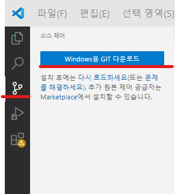  
   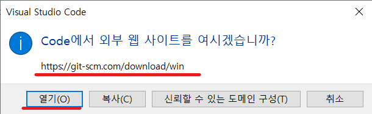  
   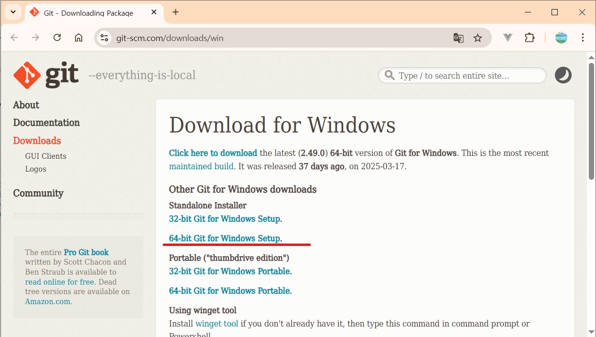  
   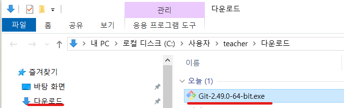  
   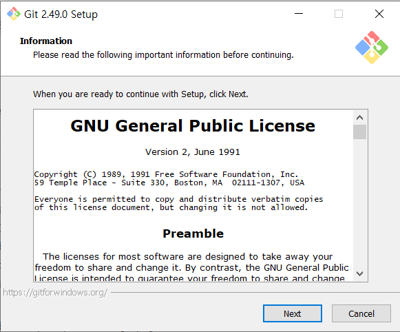

2. path 추가

3. [이름과 이메일을 설정](https://git-scm.com/book/en/v2/Getting-Started-First-Time-Git-Setup){:target="\_blank"}

```console
$ git config --global user.name "John Doe"
$ git config --global user.email johndoe@example.com
$ git config --list
```

## git clone

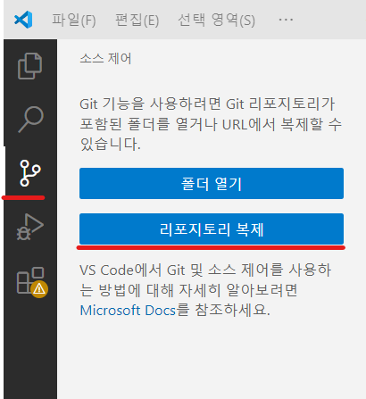
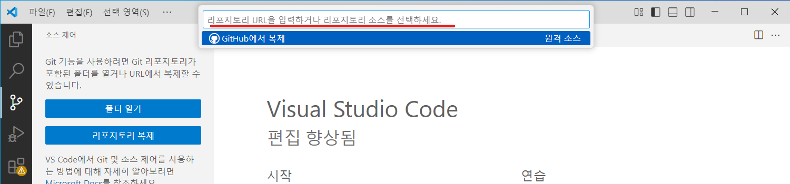
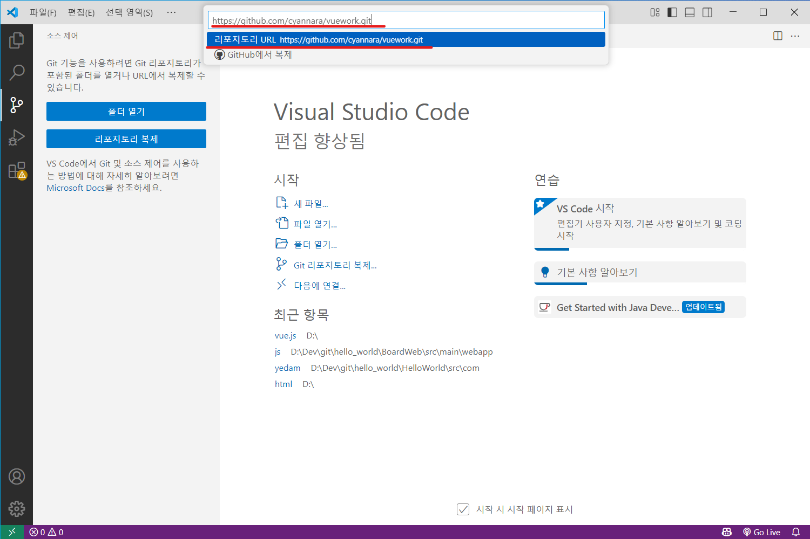
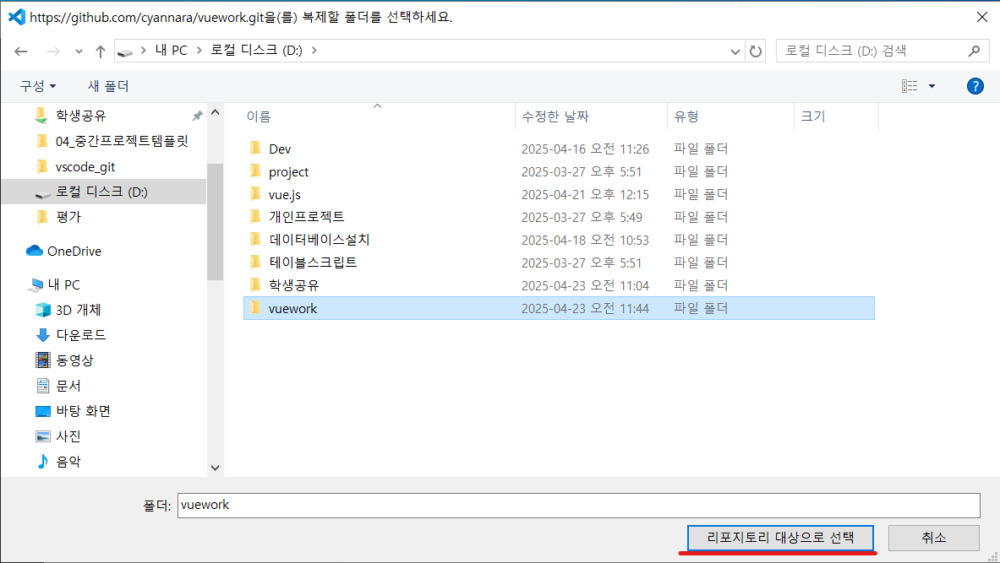
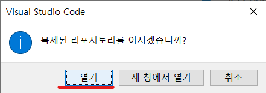

## 터미널에서 github clone 연동

```js
> git clone https://github.com/{name}/{repository}
> git remote set-url origin https://{name}@github.com/{name}/{repository}
> git push
```

## GitHub에서 복제(clone)

1. github에서 리포지토리 생성

2. github repository clone
   F1 => 'git clone' 입력 => 'Git: Clone' 메뉴 선택 => 리포지토리 선택 => 로컬에 저장될 위치 지정

3. add stage  
   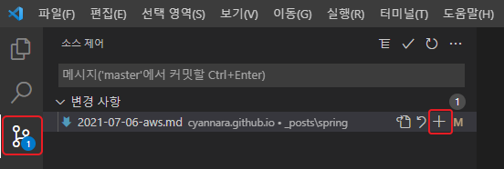

4. commit  
   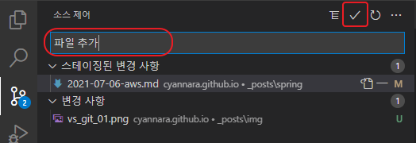

5. push  
   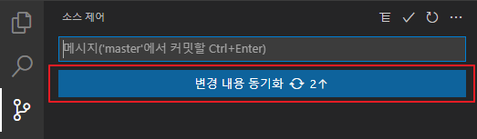

## 로컬 폴더를 github로 올리기

1. 로컬폴더를 git init로 초기화
   F1 => 'git init' 입력 => 로컬 폴더 선택
   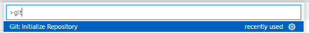

2. [Source controll]에서 add -> commit

3. [Source controll] 에서 publish

## pull request

1. `fork`를 통해 원본 레포지토리를 가져와 내 레포지토리를 만든다.
2. `clone`을 통해 fork한 내 레포지토리를 로컬에 가져온다.
3. 로컬에서 작업 후 `add` -> `commit` -> `push`를 통해 내 레포지토리에 작업내용을 업로드한다.
4. `Pull Request`를 통해 내 작업내용을 원본 레포지토리에 반영해달라고 요청한다.

## branch

#### 브랜치 병합

```sh
git fetch origin            # 원격 최신 상태 가져오기(브랜치목록동기화)
git checkout dev            # 로컬 dev 브랜치 최신화
git pull origin dev
git checkout my-branch      # 개인브랜치로 이동
git merge dev               # dev 브랜치를 개인브랜치에 머지 (자동으로 merge commit 됨)
git status                  # 총돌시 상태 확인하고 파일 수정하고 add하고 commit
git push origin my-branch   # 개인 브랜치 원격 반역

github 사이트에서 pull request 요청 (원격 리포지토리 개인브랜치를 dev 브랜치에 병합요청)
```

#### 원격 브랜치 업데이트

```sh
git remote update
```

#### 원격 브랜치 목록

```sh
git branch -r
```

#### 로컬 브랜치 목록

```sh
git branch -a
```

#### 로컬저장소 브랜치 리스트

```sh
git branch -al
```

#### 원격 브랜치 동기화

```sh
git fetch --all --prune
git purne
```

## 윈도우 자격증명 사용하기

이 명령어는 Git이 Windows 자격 증명 관리자를 사용하도록 지시합니다.  
credential.helper 설정을 확인

```sh
git config --global credential.helper
```

자격 증명 도우미를 manager로 설정

```sh
git config --global credential.helper manager
```

## Git pull이 안되는 경우

- fatal: refusing to merge unrelated histories <-- 공통된 커밋 포인트가 없다(commit history가 서로 관련이 없다)는 에러

git pull origin main **--allow-unrelated-histories**
--allow-unrelated-histories 옵션은 이미 존재하는 두 프로젝트의 기록(history)을 저장하는 드문 상황에 사용하는 것으로 강제로 pull한다

## pull 과정

- pull = fetch + merge FETCH_HEAD
- fetch 는 원격 저장소에 있는 내용을 가져옴. 원격 저장소의 내용를 확인만 함
- merge는 원격저장소와 로컬 저장소가 공통으로 가지고 있는 commit 지점이 존재해야하고 그지점부터 병합을 시도
- HEAD 는 로컬에서 가장 마지막에 행해진 commit 정보
- FETCH_HEAD는 원격 저장소의 최신 commit 이력

## [README.md 작성](https://www.freecodecamp.org/korean/news/gisheobeu-peurojegteue-rideumi-paileul-jal-jagseonghaneun-bangbeob/){:target="\_blank"}

- 프로젝트 설치 방법과 실행 방법을 명시
- 간단하면서 구체적으로 작성
- 프로젝트명
- 프로젝트 설명
- 목차(선택)
- 프로젝트 설치 및 실행 방법
- 프로젝트 사용방법
- 팀원 및 참고자료
- 라이센스
- 뱃지
- 프로젝트에 기여하는 방법
- 테스트

## 참고사이트

- [Working with GitHub in VS Code](https://code.visualstudio.com/docs/editor/github){:target="\_blank"}
- [git 입문](https://dreamsea77.tistory.com/313)
- [git 심화](https://dreamsea77.tistory.com/314)
- [git branch 전략](https://devocean.sk.com/blog/techBoardDetail.do?ID=165571&boardType=techBlog)

## git 명령어

git fetch 시 ref 에러는 일반적으로 원격 저장소의 특정 브랜치 또는 태그가 로컬 저장소에 존재하지 않거나, 원격 저장소와 로컬 저장소가 동기화되지 않아 발생

1. 원격 저장소에서 최신 변경 사항 가져오기  
   git fetch origin 명령어를 사용하여 원격 저장소(origin)의 최신 변경 사항을 다운로드합니다.  
   git fetch --all 명령어를 사용하여 모든 원격 저장소의 변경 사항을 다운로드할 수도 있습니다.

2. 로컬 브랜치 업데이트  
   git branch -v 명령어를 사용하여 로컬 브랜치와 원격 브랜치의 관계를 확인합니다.
   git checkout <로컬 브랜치 이름> 명령어를 사용하여 해당 로컬 브랜치로 이동합니다.  
   git merge origin/<원격 브랜치 이름> 명령어를 사용하여 원격 브랜치의 변경 사항을 로컬 브랜치에 병합합니다.

3. 원격 저장소에 존재하지 않는 로컬 브랜치 제거  
   git branch -d <로컬 브랜치 이름> : 제거  
   git branch -D <로컬 브랜치 이름> : 강제로 제거

4. --force 옵션 사용 (주의)  
   git push --force origin <로컬 브랜치 이름> 명령어를 사용하여 로컬 브랜치를 강제로 원격 저장소에 푸시할 수 있습니다.  
   주의: 이 방법은 원격 저장소의 데이터를 삭제할 수 있으므로, 사용 시 주의해야 합니다.

예시:
만약 "fatal: couldn't find remote ref dev" 에러가 발생하고, 원격 저장소에 dev 브랜치가 없다면, dev 브랜치를 삭제하거나, origin에 dev 브랜치가 존재하는지 확인한 후, 해당 브랜치를 로컬에 가져와야 합니다.

```
# dev 브랜치 삭제
git branch -d dev

# origin에 dev 브랜치가 있는지 확인
git branch -r

# origin에서 dev 브랜치를 로컬로 가져오기 (존재한다면)
git fetch origin
git branch --track dev origin/dev
git checkout dev
```
