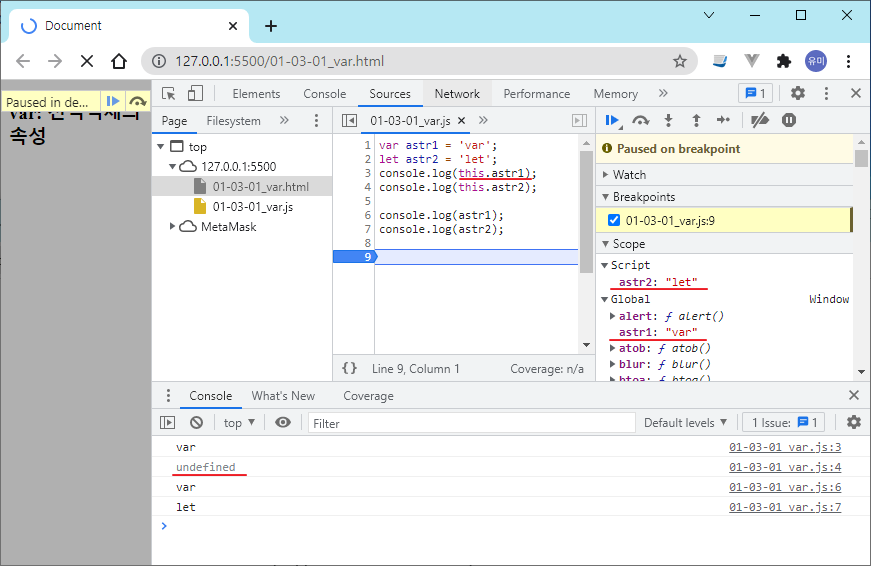

## 참고사이트

* [모질라 자바스크립 가이드](https://developer.mozilla.org/ko/docs/Web/JavaScript/Guide){:target="_blank"}
* [모던자바스크립트 Deep Dive(이웅모)](https://poiemaweb.com/js-introduction){:target="_blank"}
* [모던 JavaScript 튜토리얼](https://ko.javascript.info/){:target="_blank"}
* [w3schools](http://w3schools.com){:target="_blank"}
* [developer-readmap](https://github.com/kamranahmedse/developer-roadmap){:target="_blank"} [developer-readmap](https://roadmap.sh/)
* [ecma standard](https://www.ecma-international.org/publications-and-standards/standards/ecma-262/){:target="_blank"}
* [fetch 모질라](https://developer.mozilla.org/ko/docs/Web/API/Fetch_API/Using_Fetch){:target="_blank"}

## 자바스크립트 버전 [(참고사이트)](https://www.greycampus.com/blog/programming/java-script-versions){:target="_blank"}

* ES5    = ES5(2009년) : callback/JSON/getter,setter/Date.now() 
* ES2015 = ES6 : let/const/Arrow funtion/for~of/default,rest parameter/spread operator(...)/template literal/promise/Map/Set/Module/Symbol/class
* ES2016 = ES7 : **(연산자)/array includes()
* ES2017 = ES8 : async,await/str.padStart(),padEnd()/Object.values()/Object.entries()/ trailing commas
* ES2018 = ES9 : rest properties(...)
* ES2019 = ES10
* ES2020 = ES11
* 매년 6월에 새 버전이 나옴
* eclipse는 EcmaScript 6을 지원
* `바벨(Babel)` : 자바스크립트 코드를 구 표준을 준수하는 코드로 바꿔줌. async/await를 지원하지 않는 브라우저를 만나면 Babel은 이전 브라우저에서 작동하는 polyfill를 자동으로 제공합니다.
* `폴리필(polyfill)` : 변경된 표준을 준수할 수 있게 기존 함수의 동작 방식을 수정하거나, 새롭게 구현한 함수의 스크립트를 폴리필이라 부름. 구현이 누락된 새로운 기능을 메꿔주는 역할.

## 변수선언

* `const` : 상수선언. 값 변경불가. 객체나 배열의 원소값은 변경 가능 
* `let` : 변수가 사용되는 scope가 존재. 중복선언 방지.  hoisting 안됨
* `var` : 전역객체 속성이 생성되어 전역객체로 접근. hoisting됨
* `호이스팅` : 미선언변수 사용으로 인한 오류를 방지하기 위해서 선언하기 전에 사용한 변수는 호이스팅에 의해 위로 끌어 올려져 선언되지만 초기화는 하지 않음. (2장8절 참조)

```javascript
let cnt = 10;      // 중복선언 방지(err msg : Identifier 'XXX' has already been declared)
const init = 10;   // 상수선언. 값 변경불가(err msg : Assignment to constant variable)
const obj = { };   // 상수선언. 값(타입) 변경불가. 객체나 배열의 원소값은 변경 가능
```

  

## 예약어

arguments / await / break / case / catcl / class / const / debuffer / default / delete / do / else / enum / eval / export / extends / false / finally / for / function / if / implements / import / in / Infinity / instanceof / interface / let / NaN / null / package / private / protected / public / return / static / super / switch / this / /throw / true / typeof / undefined / var / void / while / with / yield

## 원시형 데이터 타입과 참조형 데이터 타입

* 원시형 데이터 타입 : 숫자형/문자형('')/불리언(true,false)/심볼형/null/undefined
* `심볼형` : 문자열 안지를 받아 고유한 키 값을 생성. 같은 인자를 넘겨도 다른 키 값이 생성. 객체의 속성 키로 사용함.Symbile('문자값') 
* 참조형 데이터 타입 : 객체(함수, 배열, 맵, 집합)

