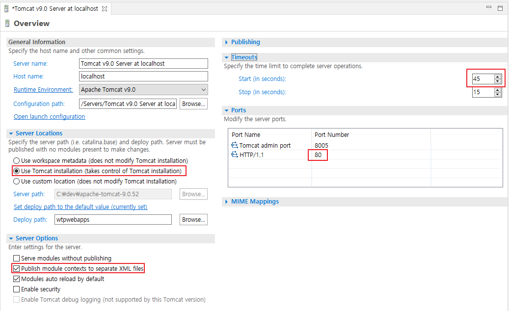
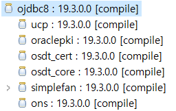

## spring project 생성
1. pom.xml  
	version 변경  
		org.springframework-version -> 5.3.16  
		junit version  -> 4.12  
		java version -> 11  
			
	dependency 추가:   
		spring-test,  
		lombok,   
		jackson   
		dbcp, mybatis, ojdbc8, spring-jdbc  
		tiles,  
		fileupload  
		aspectjweaver  


2. datasource-context.xml  
	db.properties  
	dbcp - connection pool 설정  

3. mybatis-context.xml  
   mybatis-config.xml  

4. web.xml 변경
	context-param : classpath:config/*-context.xml  


## tomcat 설정
C:\dev\apache-tomcat-9.0.50\wtpwebapps\prjt  
C:\dev\workspace\.metadata\.plugins\org.eclipse.wst.server.core\tmp0\wtpwebapps\prjt


## jdbc로그 설정  
slf4j  <- 인터페이스  
  - 로그구현체  commom-log  , log4j,  logback  
http://logging.apache.org/log4j/1.2/apidocs/org/apache/log4j/xml/doc-files/log4j.dtd  

1. pom.xml  
````javascript
		<dependency>
		    <groupId>com.oracle.database.jdbc</groupId>
		    <artifactId>ojdbc10</artifactId>
		    <version>19.3.0.0</version>
		</dependency>		
```` 
  
log4jdbc 의존성 추가  
````javascript
		<!-- log4jdbc -->
		<dependency>
			<groupId>org.bgee.log4jdbc-log4j2</groupId>
			<artifactId>log4jdbc-log4j2-jdbc4.1</artifactId>
			<version>1.16</version>
		</dependency>
````	
log4j 버전을 1.2.15 에서 1.2.17.로 변경  
@Log4j는 log 객체를 생성하여 로그를 출력할 수 있게 하는 어노테이션을 사용하려면 runtime scope는 삭제함   
````javascript  
		<dependency>
			<groupId>log4j</groupId>
			<artifactId>log4j</artifactId>
			<version>1.2.17</version>
````

<del>~~&lt;scope&gt;runtime&lt;/scope&gt;~~</del>  

2. global.properties  
````
jdbc.driver = net.sf.log4jdbc.sql.jdbcapi.DriverSpy
jdbc.url = jdbc:log4jdbc:oracle:thin:@localhost:1521:xe
jdbc.username = hr
jdbc.password = hr
````
3. log4j.xml 파일 설정  
   a. log4j.dtd 경로 변경 
````xml
     <!DOCTYPE log4j:configuration PUBLIC "-//APACHE//DTD LOG4J 1.2//EN" "log4j.dtd">
````	 
     "log4j.dtd"  =>  http://logging.apache.org/log4j/1.2/apidocs/org/apache/log4j/xml/doc-files/log4j.dtd  

   b. logger 추가  
````javascript
	<logger name="jdbc.resultset">
		<level value="warn" />
	</logger>

	<logger name="jdbc.audit">
		<level value="warn" />
	</logger>

	<logger name="jdbc.connection">
		<level value="warn" />
	</logger>
````  
4. src/main/resources/log4jdbc.log4j2.properties 파일 생성  
````
log4jdbc.spylogdelegator.name= net.sf.log4jdbc.log.slf4j.Slf4jSpyLogDelegator
````

## 트랜잭션

1. jdbc 트랜잭션 처리  

```java
try{
      conn = db.connect();
      conn.setAutoCommit(false);

      String sql1 = "UPDATE table1 SET data1 = ? WHERE data1 = 100";
      String sql2 = "UPDATE table2 SET data1 = ? WHERE data1 = 200";

      pstmt1 = conn.prepareStatement(sql1);
      pstmt1.setInt(1,a);
      pstmt1.executeUpdate();

      pstmt2 = conn.prepareStatement(sql2);
      pstmt2.setInt(1,a);
      pstmt2.executeUpdate();
      conn.commit();

} catch (Exception se) {
      conn.rollback();
      se.printStackTrace();
} finally {
      db.close(conn);
}
```

2. spring 트랜잭션 설정
```xml
       <!-- transactionManager 빈 등록  -->
	<bean id="transactionManager" 
	      class="org.springframework.jdbc.datasource.DataSourceTransactionManager" >
		<property name="dataSource" ref="dataSource"></property>
	</bean>
	
	<!-- @Transactional 애노테이션 스캔-->
	<tx:annotation-driven/>

       <!-- <aop:aspectj-autoproxy proxy-target-class="true"/> -->
```

3. service 클래스에 어노테이션 설정

```java
@Service
public class OrdServiceImpl implements OrdService {

	@Autowired OrdDtlMapper ordDtlMapper;
	@Autowired OrdMapper ordMapper;
	
	@Override
	@Transactional
	public int insert(String data) {		
		int r = ordMapper.insert(data);
		ordDtlMapper.insert(data);
		return r;
	}
}
```

4. aop 설정 : 모든 서비스 메서드에 자동으로 트랜잭션 설정
```xml
	<!-- Transaction Advice 설정 -->
	<tx:advice id="txAdvice" transaction-manager="transactionManager">
		<tx:attributes>
			<tx:method name="find*" read-only="true" />
			<tx:method name="*"/>
		</tx:attributes>
	</tx:advice>
	
	<!-- Transaction AOP 설정 -->
	<aop:config>
		<aop:pointcut expression="execution(* com.yedam.app..*ServiceImpl.*(..))" id="txPointCut"/>
		<aop:advisor advice-ref="txAdvice" pointcut-ref="txPointCut"/>
	</aop:config>
```

6. TestCase로 Service 계층을 테스트 하면 정상적으로 트랜잭션 처리되나 Controller를 호출하면 트랜잭션 처리가 안되는 경우 조치방법
에러메시지 : JDBC Connection will not be managed by Spring  
조치방법 : servlet-context.xml 에서 Controller 이 아닌 Annotation들을 exclude-filter 처리함  

