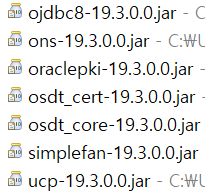

## tomcat 설정
C:\dev\apache-tomcat-9.0.50\wtpwebapps\prjt
C:\dev\workspace\.metadata\.plugins\org.eclipse.wst.server.core\tmp0\wtpwebapps\prjt


## jdbc로그 설정  
1. pom.xml  
````javascript
		<dependency>
			<groupId>com.oracle.ojdbc</groupId>
			<artifactId>ojdbc8</artifactId>
			<version>19.3.0.0</version>
		</dependency>		
```` 
  
````javascript
		<!-- log4jdbc -->
		<dependency>
			<groupId>org.bgee.log4jdbc-log4j2</groupId>
			<artifactId>log4jdbc-log4j2-jdbc4.1</artifactId>
			<version>1.16</version>
		</dependency>
````		
````javascript
		<dependency>
			<groupId>log4j</groupId>
			<artifactId>log4j</artifactId>
			<version>1.2.17</version>
````			    


2. global.properties  
````
jdbc.driver = net.sf.log4jdbc.sql.jdbcapi.DriverSpy
jdbc.url = jdbc:log4jdbc:oracle:thin:@도메인orIP:1521:ORCL
jdbc.username = hr
jdbc.password = hr
````
3. log4j.xml 파일 설정  
   a. log4j.dtd 경로 변경   
       http://logging.apache.org/log4j/1.2/apidocs/org/apache/log4j/xml/doc-files/log4j.dtd  

   b. logger 추가  
````javascript
	<logger name="jdbc.resultset">
		<level value="warn" />
	</logger>

	<logger name="jdbc.audit">
		<level value="warn" />
	</logger>

	<logger name="jdbc.connection">
		<level value="warn" />
	</logger>
````  
4. log4jdbc.log4j2.properties 파일 생성  
````
log4jdbc.spylogdelegator.name= net.sf.log4jdbc.log.slf4j.Slf4jSpyLogDelegator
````